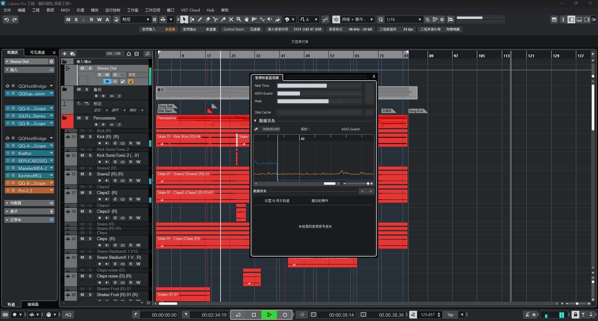
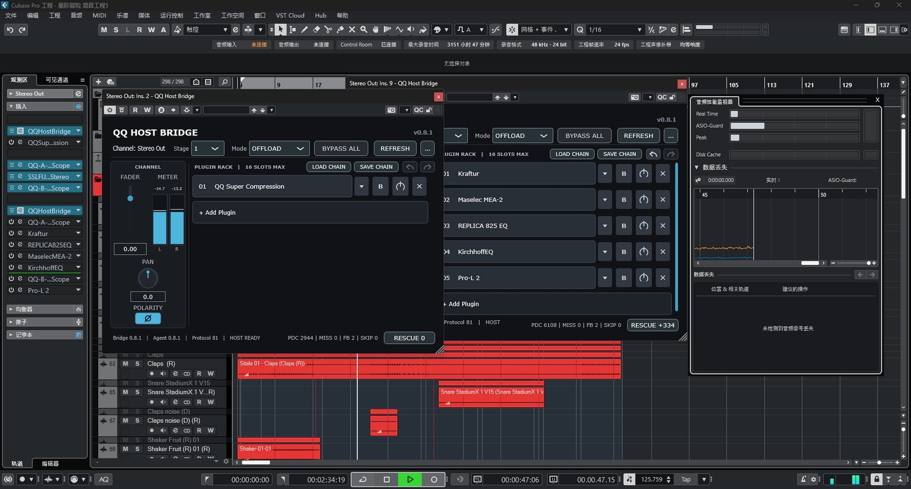
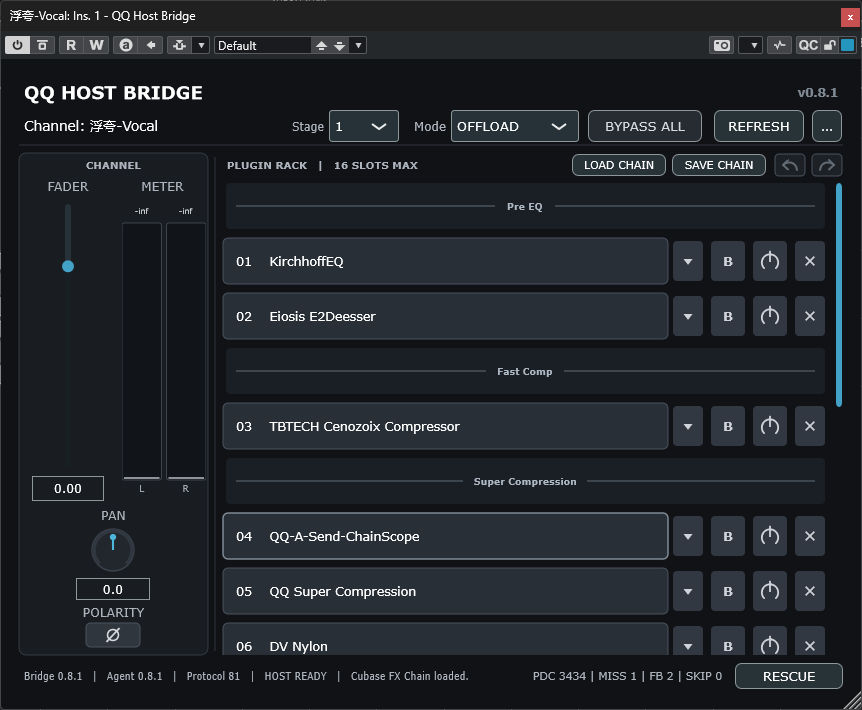
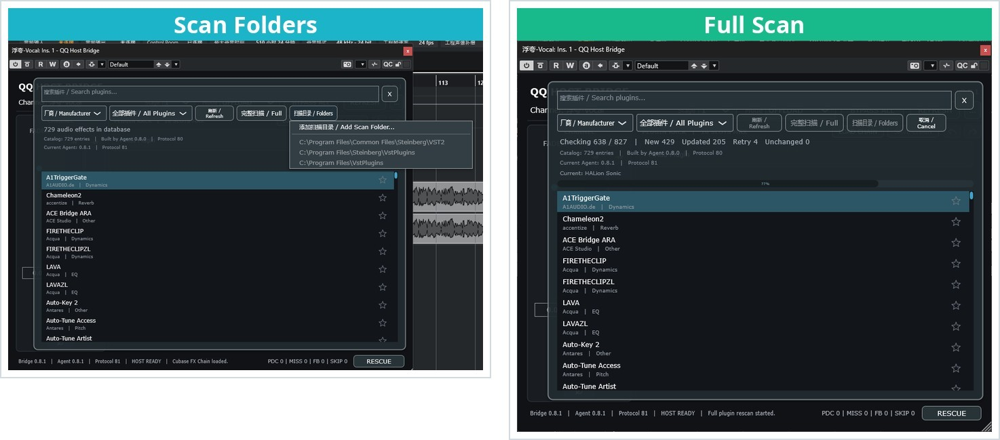
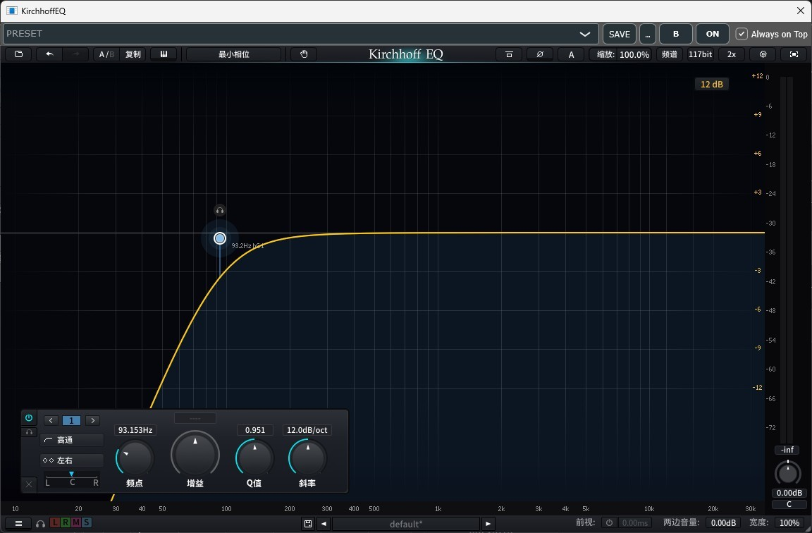
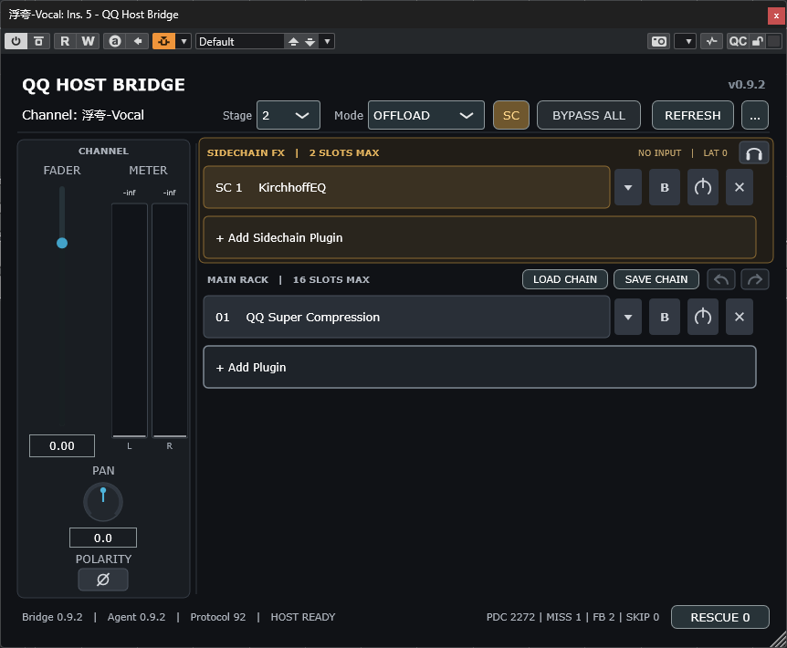

# QQ Host

**中文 | English**

**QQ Host｜性能桥接机架，一个可以将 DAW 内的单核处理分散成多核处理的效果器。**

**QQ Host | A performance bridge rack that moves CPU-heavy processing away from the DAW's single real-time thread so the work can be spread across more CPU cores.**

> QQ Host 是闭源软件。本公开仓库只提供经过确认的二进制 Release、安装信息与公开版本记录；源码仓库保持私有。
>
> QQ Host is closed-source software. This public repository provides only approved binary releases, installation information, and public version history; the source repository remains private.

## QQ Host 是做什么的 / What QQ Host does

工程总 CPU 占用并不高，但只要某条轨道插件多、处理链 CPU 占用高，DAW 的实时性能就可能先到极限，出现 ASIO 峰值、卡顿或爆音。QQ Host 就是为这种情况设计的。

QQ Host 专门针对 DAW 混音插件链设计。使用方法仍然像普通 Insert：在 DAW 轨道上插入 QQ Host Bridge，在 Bridge 的 Rack 里加载 VST2/VST3 效果器，后台 QQ Host 自动接管处理。你不需要把音频送进另一个独立 Mixer，也不用离开熟悉的 DAW 工作流。

A session may still show moderate total CPU use, yet one track with many plug-ins and a CPU-intensive processing chain can reach the DAW's real-time limit first, causing ASIO peaks, glitches, or dropouts. QQ Host is designed for exactly this situation.

QQ Host is designed specifically for DAW mixing plug-in chains. The workflow still feels like a normal Insert: add QQ Host Bridge to a track, load VST2/VST3 effects in its Rack, and let the background QQ Host handle the processing. There is no separate mixer and no need to leave the DAW workflow you already know.

## 工作方式一眼看懂 / See how it works

| DAW 内的高占用处理链 / CPU-heavy chain in the DAW | 转移到 QQ Host 后台 / Offloaded through QQ Host |
|---|---|
|  |  |

QQ Host Bridge 留在轨道 Insert 中，第三方插件由后台 Host 承载。你仍然在 DAW 工程里工作，但高占用插件链不再全部挤在同一个实时处理线程上。

QQ Host Bridge stays in the track Insert while third-party plug-ins are hosted by the background app. You keep working inside the DAW, while CPU-heavy chains no longer have to remain on the same real-time processing thread.

### Bridge、浏览器与插件窗口 / Bridge, browser, and hosted editor

插件浏览器会明确标记 VST2 与 VST3，并只收录音频效果器，不把乐器扫进效果器列表。

The plug-in browser clearly labels VST2 and VST3 entries and keeps instruments out of the audio-effects list.

第三方插件编辑器独立打开；操作插件时 Bridge 继续留在 DAW 中，只有用户主动关闭 Bridge 时才会隐藏。

Hosted plug-in editors open independently. The Bridge remains visible in the DAW while you operate a plug-in unless you explicitly close it.

### 0.9.2 侧链效果器 / Sidechain FX in 0.9.2

侧链端最多可插入两个效果器。SC 按钮可折叠整个模块，耳机按钮用于单独监听处理后的侧链信号；主链各 Slot 按已声明延迟取得时间对齐的侧链输入。

The sidechain path can host up to two effects. Use SC to collapse the entire module and the headphone button to monitor the processed sidechain signal. Each Main Rack slot receives a sidechain input aligned from declared plug-in latency.

### 能力边界 / What it does not claim

QQ Host 的作用是改变插件托管和处理调度方式，帮助工程更充分地利用多核 CPU；它不会把某个第三方插件内部的单线程 DSP 自动改写成多线程算法。实际效果取决于插件、Buffer Size、DAW 路由、Bridge 数量、IPC 开销和电脑配置。

QQ Host changes how plug-ins are hosted and scheduled so the session can use a multi-core CPU more effectively. It does not rewrite a third-party plug-in's internally single-threaded DSP as a parallel algorithm. Results depend on the plug-ins, buffer size, DAW routing, Bridge count, IPC overhead, and the computer.

## 当前公开版本 / Current public release

- 产品 / Product: **QQ Host**
- 厂商 / Vendor: **Qing Audio**
- 版本 / Version: **1.0.10 · Stable**
- 发布日期 / Release date: **2026-09-19**
- 授权 / Licensing: **闭源专有软件 / Closed-source proprietary software**

[QQ Host 1.0.10 Release 页面 / Release page](https://github.com/Qing-Audio/QQHost-Release/releases/tag/v1.0.10)

## 下载附件 / Download assets

- [Windows x64 VST3](https://github.com/Qing-Audio/QQHost-Release/releases/download/v1.0.10/QQ.Host.1.0.10.Windows.x64.VST3.zip)
- [macOS Apple Silicon VST3](https://github.com/Qing-Audio/QQHost-Release/releases/download/v1.0.10/QQ.Host.1.0.10.macOS.Apple.Silicon.VST3.zip)
- [macOS Intel x86_64 VST3](https://github.com/Qing-Audio/QQHost-Release/releases/download/v1.0.10/QQ.Host.1.0.10.macOS.Intel.x86_64.VST3.zip)
- [macOS Universal 2 AU](https://github.com/Qing-Audio/QQHost-Release/releases/download/v1.0.10/QQ.Host.1.0.10.macOS.Universal.2.AU.zip)
- [中文安装说明 / Chinese installation guide](https://github.com/Qing-Audio/QQHost-Release/releases/download/v1.0.10/QQ.Host.1.0.10.Installation.Guide.Chinese.txt)
- [English installation guide](https://github.com/Qing-Audio/QQHost-Release/releases/download/v1.0.10/QQ.Host.1.0.10.Installation.Guide.English.txt)
- [1.0.6 中文手册 / Chinese manual](https://github.com/Qing-Audio/QQHost-Release/releases/download/v1.0.10/QQ.Host.1.0.6.User.Manual.Chinese.pdf)
- [1.0.6 English manual](https://github.com/Qing-Audio/QQHost-Release/releases/download/v1.0.10/QQ.Host.1.0.6.User.Manual.English.Edition.pdf)

请只下载对应平台与格式的 ZIP，并阅读安装说明。中英文 PDF 沿用真实的 1.0.6 版本名；1.0.10 安装说明补充手动刷新操作。[上一公开版 1.0.4](https://github.com/Qing-Audio/QQHost-Release/releases/tag/v1.0.4) 保留供回退。

Download the ZIP matching your platform and format, and read the installation guide. The bilingual PDFs retain their actual 1.0.6 labels; the 1.0.10 guides explain manual recovery. [Previous public release 1.0.4](https://github.com/Qing-Audio/QQHost-Release/releases/tag/v1.0.4) remains available for rollback.

> GitHub 自动生成的 Source code ZIP/TAR 只是本下载页仓库的资料快照，不是插件安装包。
>
> GitHub's automatic Source code ZIP/TAR files are snapshots of this download-page repository, not plug-in installers.

## 支持范围 / Compatibility

- Windows 10/11 x64：VST3 Bridge + 后台 QQ Host.exe。 / VST3 Bridge + background QQ Host.exe.
- macOS 11 或更新版本：Apple Silicon VST3、Intel x86_64 VST3、Universal 2 AU。 / macOS 11 or later: Apple Silicon VST3, Intel x86_64 VST3, and Universal 2 AU.
- 可托管已获授权的原生 64-bit VST2/VST3 音频效果器；浏览器标记格式并排除乐器，不支持 32-bit VST2。 / Hosts licensed native 64-bit VST2/VST3 audio effects; the browser labels formats and excludes instruments. 32-bit VST2 is unsupported.
- 单插件 SAVE 默认保存 `.vstpreset`；VST2 使用兼容 Cubase 的 VST2 状态容器，仍可导出原生 FXP 和导入 FXP/FXB。此容器不代表把插件转换为 VST3。 / Single-plug-in SAVE defaults to `.vstpreset`; VST2 uses a Cubase-compatible VST2 state container, while native FXP export and FXP/FXB import remain available. This container does not convert the plug-in to VST3.
- Cubase `.fxchainpreset` 可包含混合 VST2/VST3 机架。如果未被 MediaBay 立即收录，可尝试同一文件名覆盖保存两次，必要时 **Quick Rescan Disk**。 / Cubase `.fxchainpreset` supports mixed VST2/VST3 racks. If not immediately discovered, try saving twice with the same filename and overwrite confirmation, then **Quick Rescan Disk** if needed.
- macOS 包未经 Apple Developer ID 公证；可信来源与安全操作说明见安装指南。 / macOS packages are not Apple Developer ID notarized; see the installation guide for trusted-source and safe-installation guidance.

## 安装与基本使用 / Installation and basic use

1. 完全退出 DAW 与插件扫描器。 / Fully quit the DAW and plug-in scanners.
2. 下载并解压与你的平台和格式对应的 1.0.10 ZIP。 / Download and extract the 1.0.10 ZIP matching your platform and format.
3. 按随包安装说明移走旧版并复制新版；Windows 的 Bridge 与后台 Host 须同版本、同目录，macOS 分别按说明安装。 / Follow the guide to move old files out and install the new pair. On Windows, Bridge and Host must share the same version and folder; on macOS use the documented separate locations.
4. 在 DAW 中重新扫描插件。 / Rescan plug-ins in the DAW.
5. 在轨道 Insert 中加载 QQ Host Bridge，再在 Bridge Rack 中加载第三方 VST2/VST3 效果器。 / Insert QQ Host Bridge, then load VST2/VST3 effects in its Rack.
6. FL Studio 用户必须在插件 Wrapper 的 Troubleshooting 中启用 **Use fixed size buffers**，并在 More 中同时启用 **Process maximum size buffers** 与 **Use maximum buffer size from host**。 / FL Studio users must enable **Use fixed size buffers**, plus both maximum-buffer options under More, in the Wrapper Troubleshooting page.

## 主要功能 / Main features

- 保留 DAW Insert 工作流的 Bridge + 后台 Host 架构 / Bridge + background Host architecture preserving the DAW Insert workflow
- 多 Bridge、多 Slot VST2/VST3 效果器 Rack / Multi-Bridge, multi-Slot VST2/VST3 effect Rack
- OFFLOAD 与 LIVE：OFFLOAD 通过缓冲与后台调度分担混音时的实时 CPU 压力；LIVE 减少桥接等待，但不提供同等的 CPU 卸载优势。 / OFFLOAD and LIVE: OFFLOAD uses buffering and background scheduling to reduce real-time CPU pressure when mixing; LIVE reduces bridge waiting but does not provide the same CPU-relief advantage.
- Internal PDC、Per-Slot PlayHead 与 Latency Rescue
- 最多两个效果器的 Sidechain FX Rack、可折叠 SC 面板与独立监听 / Two-slot Sidechain FX Rack, collapsible SC panel, and solo monitoring
- BYPASS ALL、Power、Fader、Pan、Polarity 与 Meter
- 隔离扫描并只收录效果器 / Isolated scanning restricted to audio effects
- Cubase FX Chain 载入/保存、自动参数镜像、Undo/Redo
- 工程恢复、独立 Hosted Editor 与运行时故障隔离 / Project restore, independent Hosted Editor, and runtime fault isolation

## 逐版本变化 / Changes by version

### 1.0.5 — 预置与机架操作 / Presets and rack operation

改善兼容身份下的 VST2/VST3 预置发现与加载、Control Room 状态恢复保护及复制轨道时的局部恢复。插件可以跨 Divider 拖动。Cubase 未列出预置时，提示使用同一文件名覆盖保存两次，必要时再执行 Quick Rescan Disk。

Improves discovery and loading of compatible VST2/VST3 presets, Control Room restoration safeguards and local recovery during track duplication. Plug-ins can move across dividers. If Cubase does not list a preset, try saving twice under the same filename with overwrite confirmation, then Quick Rescan Disk if needed.

### 1.0.6 — Classic / Light / Dark

保留 Classic，增加 Light 和 Dark；只需点击 Bridge 顶部的 UI 按钮循环切换，下次打开记住上次选择。Host 工具栏跟随，不另设切换按钮。字体、Meter、推子和按钮跟随主题，并改善插件启用与关闭状态的对比。

Keeps Classic and adds Light and Dark. Click the UI button at the top of the Bridge to cycle themes; your last choice is remembered. Hosted toolbars follow without a second switch. Typography, meters, faders and buttons follow the theme, with clearer enabled/off contrast.

### 1.0.7 — 离线渲染 / Offline rendering

离线导出改用精确音频块处理，不再沿用实时调度的跳块或回退策略作为正常导出路径。

Adds exact-block processing for offline rendering instead of using realtime skip/fallback scheduling as the normal export path.

### 1.0.8 — 离线性能与故障提示 / Offline performance and fault reporting

使用事件唤醒减少等待开销，保护连续渲染的重置与旁通状态。异常时提供延迟匹配回退并标记 RENDER DEGRADED；这不代表效果处理导出成功。

Uses event-driven completion to reduce waiting overhead and protects render-pass reset and bypass state. Faults use latency-matched fallback and display RENDER DEGRADED; this is not a successful processed export.

### 1.0.9 — 局部刷新 / Local refresh

REFRESH 只恢复当前 Bridge；全局后台重启独立为需要明确确认的 Restart Agent (All Hosts)，减少其他机架被牵连的情况。

REFRESH restores only the current Bridge. Restart Agent (All Hosts) is a separate, explicitly confirmed global operation, reducing disruption to other racks.

### 1.0.10 — Imager 与手动恢复 / Imager and manual recovery

修正插件准备阶段的线程锁顺序，解决已复现的 Ozone 9 / 11 独立 Imager 卡住问题。不再因看门狗超时、机架拓扑变化或后台退出自动重启、反复恢复或自动关闭插件。保留初次启动、正常工程/预置恢复、局部 REFRESH 和明确确认的全局重启。

Fixes preparation lock ordering behind the reproduced standalone Ozone 9/11 Imager hang. Watchdog timeouts, rack-topology changes and Agent loss no longer automatically restart the Agent, repeatedly restore racks or power off plug-ins. Initial startup, normal project/preset restoration, local REFRESH and explicitly confirmed global restart remain available.

## 使用变化 / How to use the changes

- UI：点击 Bridge 顶部 UI，循环切换 Classic / Light / Dark。/ Click UI in the Bridge to cycle Classic / Light / Dark.
- 恢复：先保存工程，点击故障 Bridge 的 REFRESH。如果第三方插件完全卡住共享后台，局部刷新可能无法完成；必要时在“...”中选择 Restart Agent (All Hosts)，停止播放并保存后再确认，因为这会影响所有 Bridge。/ Save your project and use REFRESH on the affected Bridge. A plug-in that completely hangs the shared Agent may also prevent local refresh. If needed, stop playback, save, and explicitly confirm Restart Agent (All Hosts) in “...”; it affects every Bridge.
- 预置：覆盖保存两次指相同文件名并确认覆盖，不是另存两个名字；若仍未出现，在 MediaBay 对相应目录 Quick Rescan Disk。/ Saving twice means the same filename with overwrite confirmation, not two different names. If still missing, use MediaBay's Quick Rescan Disk on that folder.

## 1.0.4 更新摘要 / 1.0.4 release summary

**1.0.4 · 正式稳定版 / Stable · 2026-09-09**

- 修复 Bridge 底部 PDC / MISS / FB / SKIP 的悬停提示。鼠标停留约 0.7 秒即可查看耗时快照，播放、停止及 MISS 为零时均可使用。
- 鼠标停留时固定提示快照，避免频繁刷新让提示一直不出现；移开再悬停即可刷新，底部计数继续实时更新。
- 提示随 Bridge 窗口和 DAW 缩放；没有增加独立原生窗口或点击面板。
- 不改音频处理、线程调度、OFFLOAD/LIVE、PDC、侧链、预置、自动化或启动等待，**不宣称已修复音频 MISS**。沿用此前的 FL Studio 和 MediaBay 提示。

- Restores hover diagnostics on the Bridge's PDC / MISS / FB / SKIP row. Hover for about 0.7 seconds to view a timing snapshot, during playback or while stopped, including with zero MISS.
- Holds the snapshot while hovered so frequent updates cannot suppress the tooltip. Move away and hover again to refresh; footer counters remain live.
- The tooltip follows Bridge/DAW scaling without a separate native window or click panel.
- Audio processing, thread scheduling, OFFLOAD/LIVE, PDC, sidechain, presets, automation and startup waits are unchanged. **This release does not claim to fix audio deadline misses.** Existing FL Studio and MediaBay guidance remains applicable.

本版包含 1.0.3 发布后的悬停提示修复，旧版仍可下载。This release includes the hover-tooltip fix made after 1.0.3; the previous release remains available.

## 1.0.3 更新摘要 / 1.0.3 release summary

**1.0.3 · 正式稳定版 / Stable · 2026-09-09**

本次更新集中改善单个效果器的预置保存与选择体验。VST2 和 VST3 的 SAVE 都可以保存为 `.vstpreset`；VST2 使用兼容 Cubase 的包装，仍然是 VST2 预置，不是把插件转换成 VST3。列表按插件与格式识别预置，避免同名 VST2/VST3 插件的预置混在一起，并修复中文提示乱码。

This update focuses on saving and selecting presets for individual hosted effects. SAVE uses `.vstpreset` for both VST2 and VST3. VST2 uses a Cubase-compatible container: the preset remains VST2, and the plug-in is not converted to VST3. The list checks plug-in and format identity to keep incompatible presets apart, and Chinese feedback now displays correctly.

### 1.0.1 · 历史候选版 / Historical candidate · 2026-09-08

- 改善单插件 VST2/VST3 预置保存：完整写入并校验后再发布文件，减少留下不完整文件的风险。
- 修正原生 VST2 FXP 的长度字段，保留插件原始状态内容。
- 在 SAVE 附近提供明确的成功或失败提示。此候选版并未解决当时反馈的 Cubase 列表可见性问题，后续由 1.0.2 和 1.0.3 继续改进。

- Improved single-plug-in VST2/VST3 preset saving: files are fully written and checked before publication, reducing the risk of incomplete files.
- Corrected the native VST2 FXP length field while preserving the plug-in's state data.
- Added clear success or failure feedback beside SAVE. This candidate did not resolve the reported Cubase preset-list visibility issue; work continued in 1.0.2 and 1.0.3.

### 1.0.2 · 历史候选版 / Historical candidate · 2026-09-08

- VST3 预置补齐插件名称、厂商与效果器分类信息，帮助 Cubase MediaBay 正确识别。
- VST2 的 SAVE 默认改为兼容 Cubase 的 `.vstpreset`；“…”菜单仍可导出原生 FXP，旧 FXP/FXB 仍可导入。
- 旧预置不会被自动批量改写；用新版重新保存时才补齐新增信息。文件保存成功与 MediaBay 是否立即收录是两件不同的事。

- Added plug-in name, vendor, and effect-category information to VST3 presets for Cubase MediaBay identification.
- Changed VST2 SAVE to a Cubase-compatible `.vstpreset` by default. Native FXP export remains in the “…” menu, and existing FXP/FXB files can still be imported.
- Existing presets are not rewritten in bulk; the added information is included when a preset is saved again. A successful file save and immediate MediaBay discovery are separate outcomes.

### 1.0.3 · 正式稳定版 / Stable · 2026-09-09

- 预置列表按文件内部的插件身份与格式筛选，避免同名 VST2/VST3 插件互相显示不兼容预置。
- 列表清楚标注 `[VST3]`、`[VST2 / Cubase]`、`[VST2 / FXP]`、`[VST2 / FXB]`。导入前检查兼容性；加载失败时保留上一次成功选择的名称。
- 修复中文保存、导入及错误提示乱码；沿用现有按钮布局和颜色。
- 本轮 Cubase 测试中，VST3 与 VST2 新预置均已能直接读取。历史间歇性收录延迟的触发条件尚未确认，因此仍保留 **MediaBay > Quick Rescan Disk** 补救说明，不承诺所有环境都无需重扫。
- 沿用已验证的音频处理、OFFLOAD/LIVE、侧链、延迟补偿、自动化与启动恢复行为。

- Filters presets by their internal plug-in and format identity, preventing incompatible presets from appearing for same-named VST2/VST3 editions.
- Clearly labels `[VST3]`, `[VST2 / Cubase]`, `[VST2 / FXP]`, and `[VST2 / FXB]`. Imports are checked for compatibility; a failed load keeps the last successfully selected name.
- Fixes garbled Chinese save, import, and error messages while retaining the existing button layout and colors.
- In the latest Cubase test, new VST3 and VST2 presets could both be read directly. The conditions behind earlier intermittent discovery delays remain unconfirmed, so **MediaBay > Quick Rescan Disk** remains a documented fallback; immediate discovery is not guaranteed in every environment.
- Retains the validated audio processing, OFFLOAD/LIVE, sidechain, latency compensation, automation, and startup/restore behavior.

## 1.0.0 历史更新摘要 / Historical 1.0.0 summary

- 首个正式稳定版，由用户实测通过的候选版直接提升而来。
- 修复连续快速操作覆盖尚未被 Bridge 读取的命令结果。
- 加固 DAW 保存工程时第三方插件状态 Snapshot 的请求对应关系与新鲜度检查。
- 保持已验证的 150 ms 快速启动门控与 500 ms 保守门控，不重新引入被否决的激进启动路径。
- 更新中英文手册，加入完整的自动化 / MIDI Remote 流程，以及 VST2 `.fxp/.fxb` 与整条 `.fxchainpreset` 的区别和操作。
- 保留 0.9.22 已验证的 VST2/VST3、侧链、PDC、工程恢复、故障隔离和 Cubase FX Chain 能力。

- First formal Stable release, promoted directly from the owner-tested candidate.
- Fixes rapid consecutive actions overwriting a command result before Bridge consumes it.
- Strengthens request correlation and freshness checks for hosted plug-in state snapshots during DAW project saves.
- Keeps the validated 150 ms fast startup gate and 500 ms conservative gate without restoring the rejected aggressive startup path.
- Updates both manuals with complete Automation / MIDI Remote workflows and clear VST2 `.fxp/.fxb` versus whole-rack `.fxchainpreset` instructions.
- Retains the validated VST2/VST3, sidechain, PDC, project restore, fault isolation, and Cubase FX Chain capabilities from 0.9.22.

## 已知问题与升级注意 / Known issues and upgrade notes

- QQ Host 是实验性外部宿主；性能收益与延迟依赖 DAW、插件、缓冲区、IPC 开销与系统配置。
- 侧链和 PDC 对齐依赖第三方插件正确上报延迟与输入布局；误报或未通知宿主的动态变化无法被完全补偿。
- 仅支持已获授权的原生 64-bit VST2 与 VST3 效果器；不支持乐器或 32-bit VST2。
- Cubase 仍可能延迟收录新预置或 FX Chain。可尝试同一文件名覆盖保存两次并确认覆盖；若仍没有，在相应目录执行 **MediaBay > Quick Rescan Disk**。
- 同名插件的 VST2/VST3 版不一定可以互换预置。第三方状态恢复依赖插件自身实现，重要预置加载后请核对参数。
- macOS 包未经 Apple Developer ID 公证，系统可能要求可信来源确认与 quarantine 处理。
- FL Studio 必须启用 **Use fixed size buffers** 及其 More 中的两个最大缓冲区选项，否则 Bridge 可能不工作。
- 升级顺序：关闭 DAW -> 移走旧文件 -> 成套安装 1.0.10 -> 重新扫描。
- 以随包 1.0.10 安装说明和沿用的 1.0.6 用户手册为准；上一公开版为 1.0.4。完全卡住共享后台的插件仍可能需要全局重启；RENDER DEGRADED 不代表效果处理导出成功。

- QQ Host is experimental; performance and latency depend on the DAW, plug-ins, buffers, IPC overhead, and system configuration.
- Sidechain and PDC alignment depend on correct third-party latency and input-layout reporting. Misreported or unannounced dynamic changes cannot be fully compensated.
- Only licensed native 64-bit VST2 and VST3 effects are supported; instruments and 32-bit VST2 plug-ins are unsupported.
- Cubase may still delay discovery of new presets or FX Chains. Try saving twice with the same filename and overwrite confirmation; if still missing, use **MediaBay > Quick Rescan Disk** on the relevant folder.
- Same-named VST2/VST3 editions may not share compatible presets. State restoration depends on the third-party plug-in's implementation; verify parameters after loading important presets.
- macOS packages are not Apple Developer ID notarized and may require trusted-source confirmation and quarantine handling.
- FL Studio requires **Use fixed size buffers** and both maximum-buffer options under More; otherwise the Bridge may not process correctly.
- Upgrade order: quit DAW -> move old files out -> install the matching 1.0.10 pair -> rescan.
- Follow the 1.0.10 installation guides and retained 1.0.6 manuals; the previous public release is 1.0.4. A plug-in hanging the shared Agent may still require global restart; RENDER DEGRADED is not a successful processed export.

## 灵感与独立性声明 / Inspiration and independence

项目概念灵感来自 Vienna Ensemble Pro 8 的外部宿主与处理卸载工作流。QQ Host 为独立开发项目，与 Vienna Symphonic Library 无关联、授权或背书关系；灵感仅限于工作流方向，不涉及其代码或实现。

The concept was inspired by the external-host and processing-offload workflow of Vienna Ensemble Pro 8. QQ Host is independently developed and is not affiliated with, authorized by, or endorsed by Vienna Symphonic Library. The inspiration is limited to workflow direction, not code or implementation.

## 完整版本记录 / Complete version history

本 README 保留从 0.0.1 到 1.0.10 的完整历史；本次补齐 1.0.5—1.0.10 的逐版双语摘要。0.9.23 候选版直接更名并提升为 1.0.0，没有作为独立版本发布。遗漏版本：无。

This README preserves history from 0.0.1 through 1.0.10, adding bilingual summaries for every version from 1.0.5 through 1.0.10. The 0.9.23 candidate was renamed and promoted directly to 1.0.0 rather than released separately. Omitted versions: none.

| 版本 / Version | 中文摘要 | English summary | 状态 / Status |
|---|---|---|---|
| 0.0.1 | 建立 QQ Compute 原型与 AI 开发文档；产品后来定名为 QQ Host。 | Established the QQ Compute prototype and AI development documentation; the product was later named QQ Host. | 历史原型 / Historical prototype |
| 0.0.2 | 引入实时 IPC 原型，验证 DAW Bridge 与外部进程通信方向。 | Introduced the real-time IPC prototype and validated communication between the DAW Bridge and an external process. | 历史原型 / Historical prototype |
| 0.0.3 | 探索确定性延迟与跨进程音频时序。 | Explored deterministic latency and cross-process audio timing. | 历史原型 / Historical prototype |
| 0.0.4 | 将处理截止时间固定为一个缓冲区。 | Fixed the processing deadline to one buffer. | 历史原型 / Historical prototype |
| 0.0.5 | 探索同一音频块的低延迟处理路径。 | Explored a same-block low-latency processing path. | 历史原型 / Historical prototype |
| 0.1.0 | 建立单个 VST3 效果器宿主能力。 | Established single-VST3-effect hosting. | 历史里程碑 / Historical milestone |
| 0.1.1 | 稳定跨进程处理截止时间。 | Stabilized the cross-process processing deadline. | 历史版本 / Historical version |
| 0.1.2 | 使用最新音频块并强化安全卸载。 | Adopted latest-block handling and safer unloading. | 历史版本 / Historical version |
| 0.1.3 | 改进基础工作流与用户体验。 | Improved the core workflow and user experience. | 历史版本 / Historical version |
| 0.1.4 | 加入 DAW 工程状态持久化。 | Added DAW project-state persistence. | 历史版本 / Historical version |
| 0.1.5 | 完善工作流与通道条控制。 | Refined the workflow and channel-strip controls. | 历史版本 / Historical version |
| 0.1.6 | 加入离线快速路径与安全实时加载。 | Added an offline fast path and safer live loading. | 历史版本 / Historical version |
| 0.1.7 | 完善 VST3 宿主与 Shift 精细调节。 | Refined VST3 hosting and Shift-based fine adjustment. | 历史版本 / Historical version |
| 0.2.0 | 建立 Bridge Rack 与后台 Agent 架构。 | Established the Bridge Rack and background Agent architecture. | 架构里程碑 / Architecture milestone |
| 0.2.1 | 修复音频引擎关键问题。 | Rescued critical audio-engine behavior. | 历史版本 / Historical version |
| 0.2.2 | 修复 UI 与工作流问题。 | Rescued UI and workflow behavior. | 历史版本 / Historical version |
| 0.2.3 | 完成向统一后台工作流的过渡。 | Completed the transition toward the unified background workflow. | 历史过渡版 / Historical transition |
| 0.3.0 | 集成工作流并改善兼容性。 | Integrated the workflow and improved compatibility. | 历史版本 / Historical version |
| 0.3.1 | 加入增量扫描与实时扫描进度。 | Added incremental scanning and live scan progress. | 历史版本 / Historical version |
| 0.3.2 | 修复扫描生命周期、真实刷新与透明 Rack。 | Repaired scanner lifetime, true refresh, and transparent Rack behavior. | 历史版本 / Historical version |
| 0.3.3 | 修复扫描数据库持久化。 | Rescued scanner-database persistence. | 历史版本 / Historical version |
| 0.3.4 | 提高插件扫描完整性。 | Improved plug-in scan completeness. | 历史版本 / Historical version |
| 0.3.5 | 加强 `moduleinfo.json` 与插件身份识别。 | Strengthened `moduleinfo.json` and plug-in identity recognition. | 历史版本 / Historical version |
| 0.3.6 | 修复版本身份与 UTF-8 文本处理。 | Rescued version identity and UTF-8 text handling. | 历史版本 / Historical version |
| 0.3.7 | 加固安全扫描器与 UTF-8 UI。 | Hardened the safe scanner and UTF-8 UI. | 历史版本 / Historical version |
| 0.3.8 | 隔离插件探测进程，并只收录效果器、排除乐器。 | Isolated plug-in probing and restricted the database to effects while excluding instruments. | 历史扫描基线 / Historical scanner baseline |
| 0.3.9 | 修复工作流输入、菜单交互与基于清单的加载。 | Rescued workflow input, menu interaction, and manifest-based loading. | 历史稳定基线 / Historical stable baseline |
| 0.4.0 | 建立多 Bridge 基础架构。 | Established the multi-Bridge foundation. | 历史架构里程碑 / Historical architecture milestone |
| 0.4.1 | 修复焦点处理与 Host 生命周期。 | Rescued focus handling and Host lifetime. | 历史版本 / Historical version |
| 0.4.2 | 支持独立编辑器窗口与动态尺寸。 | Added independent editor windows and dynamic resizing. | 历史版本 / Historical version |
| 0.4.3 | 修复多 Bridge 工程恢复与恢复流程。 | Rescued multi-Bridge project restoration and recovery. | 历史版本 / Historical version |
| 0.4.4 | 加入全局恢复静默区并优化工作流。 | Added Global Restore quiescence and polished the workflow. | 历史版本 / Historical version |
| 0.4.5 | 优化 Bridge 工作流与电平表。 | Polished the Bridge workflow and metering. | 历史版本 / Historical version |
| 0.4.6 | 修复 Bridge UI 与编辑器开关。 | Rescued Bridge UI and editor-toggle behavior. | 历史版本 / Historical version |
| 0.4.7 | 加固 Host 硬生命周期与编辑器状态。 | Hardened Host lifetime and editor-state handling. | 历史版本 / Historical version |
| 0.4.8 | 加入单次启动选举、重启 Host 与可调整 Bridge。 | Added single-launch election, Restart Host, and a resizable Bridge. | 历史版本 / Historical version |
| 0.4.9 | 完成响应式 UI 与 Hosted 工具栏。 | Completed the responsive UI and Hosted toolbar. | 历史版本 / Historical version |
| 0.5.0 | 加入原生 Sidechain 与标准 VST3 Preset。 | Added native Sidechain and standard VST3 preset support. | 历史版本 / Historical version |
| 0.5.1 | 加入多 Bridge 启动队列与 Bypass 图标。 | Added multi-Bridge startup cohort handling and the Bypass icon. | 历史版本 / Historical version |
| 0.5.2 | 对迟到的恢复会话执行自动回收。 | Added automatic recycling for late restore sessions. | 历史版本 / Historical version |
| 0.5.3 | 加入迟到会话恢复屏障与编辑器激活修复。 | Added the late-session restore barrier and editor-activation rescue. | 历史版本 / Historical version |
| 0.5.4 | 加入恢复事务看门狗。 | Added the Restore Transaction Watchdog. | 历史版本 / Historical version |
| 0.5.5 | 加入 Agent 启动事务监督器。 | Added the Agent Startup Transaction Supervisor. | 历史版本 / Historical version |
| 0.5.6 | 优化 Preset、Rack 与 Browser 工作流。 | Polished the Preset, Rack, and Browser workflow. | 历史版本 / Historical version |
| 0.5.7 | 修复文本输入、编辑器尺寸与启动卡顿。 | Rescued text input, editor sizing, and startup stalls. | 历史稳定基线 / Historical stable baseline |
| 0.5.8 | 同步 Hosted Editor 窗口尺寸并采用响应式工具栏。 | Synchronized Hosted Editor window sizing and introduced a responsive toolbar. | 历史稳定基线 / Historical stable baseline |
| 0.5.9 | 加入运行时故障隔离与单 Slot 重启，降低第三方插件故障对整个后台 Host 的影响。 | Added runtime fault isolation and per-Slot restart to reduce the impact of third-party plug-in faults on the background Host. | 2026-08-30 · 历史稳定基线 / Historical stable baseline |
| 0.6.0 | 加入按上下文转发 DAW 快捷键，同时保护文本输入与插件自身快捷键。 | Added context-aware DAW shortcut forwarding while protecting text entry and plug-in-owned shortcuts. | 2026-08-30 · 历史候选 / Historical candidate |
| 0.6.1 | 修复外部插件 Undo/Redo 保留策略，避免 Bridge 快捷键破坏被宿主插件的历史。 | Corrected hosted plug-in Undo/Redo preservation so Bridge shortcuts do not disrupt plug-in history. | 2026-08-30 · 历史稳定基线 / Historical stable baseline |
| 0.7.0 | 试验手动自动化映射基础；该方案后来被自动参数镜像替代。 | Prototyped manual automation mapping; this approach was later replaced by automatic parameter mirroring. | 2026-08-31 · 已替代候选 / Superseded candidate |
| 0.7.1 | 加入自动参数镜像和 Host Touch 反馈，取代手动映射流程。 | Added automatic parameter mirroring and Host Touch feedback, replacing the manual mapping workflow. | 2026-08-31 · 历史版本 / Historical version |
| 0.7.2 | 加入 Bridge 尺寸持久化与时序诊断，便于定位界面尺寸问题。 | Added Bridge resize persistence and timing diagnostics for editor-size investigation. | 2026-08-31 · 历史候选 / Historical candidate |
| 0.7.3 | 修复自动化恢复状态，并加入 Bridge Undo/Redo 与插件状态恢复。 | Protected automation restore state and added Bridge Undo/Redo with hosted plug-in state restoration. | 2026-08-31 · 历史稳定基线 / Historical stable baseline |
| 0.7.4 | 增加上下文 S/M/L 快捷键转发，并以只读方式探测 Cubase Insert 拖拽载荷。 | Added context-aware S/M/L shortcut forwarding and a read-only Cubase Insert drag-payload probe. | 2026-08-31 · 历史候选 / Historical candidate |
| 0.7.5 | 引入内部 PDC 与每 Slot PlayHead，修复链内时间线错位。 | Introduced internal PDC and per-Slot PlayHead handling to correct in-chain timeline misalignment. | 2026-08-31 · 已验证的延续功能 / Validated carry-forward feature |
| 0.7.6 | 扩展 Cubase 拖拽 OLE 探测与诊断，但未实现未经验证的直接导入。 | Expanded Cubase drag OLE probing and diagnostics without implementing unverified direct import. | 2026-08-31 · 历史探针版本 / Historical probe |
| 0.7.7 | 加入 Cubase FX Chain 载入/保存与自宿主防护；互操作性保持受限验证状态。 | Added Cubase FX Chain load/save and self-host protection; interoperability remained a limited-validation feature. | 2026-08-31 · 历史候选 / Historical candidate |
| 0.7.8 | 改进 Divider、扫描隔离/效果器过滤、FX Chain 快速载入和 Fixed-Zero Rescue；保留兼容性边界。 | Improved Divider behavior, scan isolation/effect filtering, fast FX Chain loading, and Fixed-Zero Rescue while retaining compatibility boundaries. | 2026-08-31 · 历史候选 / Historical candidate |
| 0.8.0 | 加入 50 ms Crossfade 的 BYPASS ALL、明确的 Power UI 与 VST2 链加载保护；用户提升为稳定基线。 | Added 50 ms-crossfaded BYPASS ALL, explicit Power UI, and VST2 chain-load protection; user-promoted to Stable. | 2026-08-31 · 历史稳定基线 / Historical stable baseline |
| 0.8.1 | 将 Bypass 统一为醒目的 `B` 控件，并恢复“初始匿名、可选命名”的 Divider 工作流；不改变受保护的音频与状态行为。 | Unified Bypass as a prominent `B` control and restored the “anonymous by default, optionally nameable” Divider workflow without changing protected audio or state behavior. | 2026-08-31 · 正式回滚基线 / Formal rollback baseline |
| 0.8.2 | 修复 Hosted 自动化回声与抖动、16-Slot FX Chain 写入、旧 FX Chain 自动化关联，以及 Fader/Pan/相位 Undo/Redo。 | Corrected Hosted automation echo/jitter, 16-Slot FX Chain export, automation association for older FX Chains, and Fader/Pan/polarity Undo/Redo. | 2026-09-01 · 已验证候选 / Validated candidate |
| 0.8.3 | 安全归一化旧通用 VST3 标识与精确 CID，并加入只清理 Missing、保留 Active 的显式自动化恢复。 | Safely canonicalised legacy generic VST3 identities to exact CIDs and added explicit recovery that removes only Missing mappings while preserving Active mappings. | 2026-09-01 · 历史稳定基线 / Historical stable baseline |
| 0.8.4 | 支持已授权的 64-bit VST2 效果器并标记 VST2/VST3；将低延迟模式明确为 LIVE；修复独立编辑器、无效 Slot 重载、首次窗口闪跳和 DAW 快捷键转发。 | Added licensed 64-bit VST2 effect hosting with VST2/VST3 labels; clarified low-latency operation as LIVE; fixed independent editors, invalid-Slot reload, first-show jumping, and DAW shortcut forwarding. | 2026-09-01 · 历史稳定基线 / Historical stable baseline |
| 0.9.0 | 建立最多两个效果器的 Sidechain FX Rack、处理后侧链监听与按主链 Slot 对齐的基础架构。 | Added the two-slot Sidechain FX Rack, processed-sidechain monitoring, and the foundation for per-Main-Slot timing alignment. | 2026-09-01 · 历史候选 / Historical candidate |
| 0.9.1 | 修复仅侧链处理时的播放卡顿与双 Slot 布局重叠，并稳定侧链活动状态。 | Fixed sidechain-only playback stutter and the overlapping two-slot layout, and stabilized sidechain activity state. | 2026-09-02 · 已验证候选 / Validated candidate |
| 0.9.2 | 加入确定性侧链样本对齐验证、可折叠 SC 面板与紧凑耳机监听按钮。 | Added deterministic sidechain sample-alignment verification, a collapsible SC panel, and a compact headphone monitor button. | 2026-09-02 · 历史稳定基线 / Historical stable baseline |
| 0.9.3 | 修复 DAW 原生 Bypass 时的 PDC 误报：旁路音频继续经过与 Bridge 报告延迟一致的 Dry 延迟线。 | Fixed DAW-native Bypass PDC mismatch by keeping bypassed audio on the latency-matched Dry path. | Candidate |
| 0.9.4 | 为 Duplicate、Move 与故障隔离加入持久 Slot UUID 和恢复快照事务，避免插件消失或错误关闭链首插件。 | Added persistent Slot UUIDs and transactional recovery snapshots for Duplicate, Move and fault isolation. | Candidate |
| 0.9.5 | 一次未完成的 Idle CPU / 结构恢复自动修改试验；自动转换未覆盖关键路径，因此从未成为可用基线。 | Incomplete automated Idle CPU/structural-recovery experiment; required paths were not fully changed, so it was never a valid baseline. | Invalid test |
| 0.9.6 | 严格按 UUID 隔离故障，扩大新建 Rack 的首次调用保护，并加固结构变更后的恢复快照提交。 | Enforced UUID-only fault isolation, rack-wide first-use grace and hardened structural recovery snapshot commits. | Candidate |
| 0.9.7 | 增加运行时故障、watchdog、调用阶段和恢复原因遥测，不改变既有恢复决策。 | Added runtime-fault, watchdog, call-stage and recovery telemetry without changing recovery policy. | Diagnostic Candidate |
| 0.9.8 | 将 QQ Host 自有对齐缓冲扩容与第三方插件 `prepareToPlay` 生命周期分离，消除高延迟插件加载后的重复 Prepare 与卡顿。 | Split QQ Host alignment-buffer growth from hosted plug-in preparation, eliminating duplicate prepares and post-load stalls. | Stable |
| 0.9.9 | 移除隐藏插件编辑器持续进行的重复 Automation 扫描和高频尺寸轮询，降低长时间工程的后台 UI/锁竞争。 | Removed duplicate automation scans and aggressive hidden-editor polling that accumulated during long sessions. | Candidate |
| 0.9.10 | 首次保存 Cubase FX Chain 时先写无监视扩展名的完整临时文件，再原子发布到最终路径。 | Reworked first FX Chain publication to write a complete non-watched temporary file before atomic final-path publication. | Candidate |
| 0.9.11 | 将保存事务交给 Processor 生命周期管理，加入事务 ID、完整 busy 状态、原子发布校验和 Shell 通知。 | Moved save ownership to the processor and added transaction IDs, complete busy state, atomic verification and Shell notification. | Candidate |
| 0.9.12 | 修复含 VST2 的混合 VST2/VST3 Chain 在状态捕获阶段中断，允许保存与加载混合 FX Chain。 | Fixed VST2 state-capture aborts so mixed VST2/VST3 FX Chains can be saved and loaded. | Candidate |
| 0.9.13 | 写出 Cubase 可识别的严格 FXB v2 头，并为同类 VST2 实例生成唯一 ID；加载时只规范化私有副本。 | Added strict Cubase FXB v2 headers and unique repeated-instance IDs while normalizing only private load copies. | Candidate |
| 0.9.14 | 尝试用延迟的 MediaBay 发现刷新解决首次新文件不显示；实测无效，后续移除。 | Tried delayed MediaBay discovery refreshes for first-save visibility; real testing showed no benefit and the retries were removed. | Candidate, withdrawn |
| 0.9.15 | 对 MediaBay 外部索引问题改为明确提示；同时加入 VST2 Sidechain Bus 路由和原生 `.fxp/.fxb` 预设支持。 | Replaced ineffective MediaBay retries with guidance and added VST2 sidechain-bus routing plus native `.fxp/.fxb` support. | Candidate |
| 0.9.16 | 把缺失的 Host 路由缓冲作为独立 Prepare 条件，修复零延迟首 Slot 在音频开始前未建立 Main/Sidechain 缓冲的问题。 | Treated missing host routing buffers as an independent prepare condition for zero-latency first-slot startup. | Candidate |
| 0.9.17 | 针对 VST2 扁平输入 ABI，将 Main 固定送往物理 1/2，Sidechain 送往物理 3/4；VST3 Aux 不变。 | Routed VST2 flat physical inputs directly: Main to pins 1/2 and Sidechain to pins 3/4, leaving VST3 Aux unchanged. | Candidate |
| 0.9.18 | 增加实时 Sidechain 源峰值、VST2 物理 Pin 峰值、路由布局和 routed-block 计数，定位只在真实工程出现的问题。 | Added realtime source/pin peaks, route layout and routed-block telemetry to isolate the DAW-only VST2 sidechain failure. | Diagnostic Candidate |
| 0.9.19 | 修复单声道 DAW 轨道上的固定 4-in/2-out VST2：复制 Main 到 1/2，并把 Sidechain 送入 3/4。 | Fixed fixed 4-in/2-out VST2 effects on mono DAW tracks by mirroring Main to 1/2 and routing Sidechain to 3/4. | Stable |
| 0.9.20 | 只记录 Bridge 到达、拓扑稳定、恢复事务、首个音频块与 `HOST READY` 时序，不修改任何等待或恢复行为。 | Added startup milestone telemetry only, without changing any wait, ordering or recovery decision. | Diagnostic Candidate |
| 0.9.21 | 尝试完整 Cohort 的条件式快速启动；真实 Cubase 测试因恢复时仍使用 fallback 格式而更慢并重现卡顿，因此否决。 | Tried a conditional cohort fast path; rejected after real Cubase testing restored with fallback format, lengthened startup and reproduced the stall. | Rejected Candidate |
| 0.9.22 | Bridge 发布 DAW 的真实播放格式；只有完整且格式稳定的 Cohort 才快速恢复，否则自动保留 0.9.20 保守路径。三 Bridge Cubase 工程已确认一次进入 `HOST READY`。 | Publishes the real DAW playback format and enables fast restore only for a complete, format-stable cohort, otherwise retaining the conservative 0.9.20 path. Confirmed in the real three-Bridge Cubase project. | Stable |
| 1.0.0 | 修复连续命令结果覆盖与工程保存 Snapshot 对应/新鲜度问题；保持已验证的启动门控，并补齐自动化、MIDI Remote 与 VST2 预设说明。 | Fixes consecutive-command result overwrite and project-save Snapshot correlation/freshness; keeps the validated startup gates and completes Automation, MIDI Remote, and VST2 preset documentation. | 2026-09-05 · 正式稳定版 / Formal Stable |
| 1.0.1 | 改善单插件预置完整写入、校验和保存反馈，修正原生 FXP 长度；当时的 Cubase 列表可见性问题尚未解决。 | Improved complete preset publication, validation and save feedback, and corrected native FXP length; the reported Cubase list-visibility issue remained unresolved. | 历史候选版 / Historical candidate |
| 1.0.2 | 补齐 VST3 识别信息；VST2 默认保存兼容 Cubase 的 .vstpreset，保留原生 FXP 导出及 FXP/FXB 导入。 | Added VST3 identification metadata and Cubase-compatible .vstpreset saving for VST2, retaining native FXP export and FXP/FXB import. | 历史候选版 / Historical candidate |
| 1.0.3 | 按插件身份隔离预置列表、明确格式标签、修复中文乱码；保留必要时 Quick Rescan Disk 的提示。 | Isolates preset lists by plug-in identity, adds clear format labels, and fixes Chinese text; retains Quick Rescan Disk guidance when needed. | 2026-09-09 · 正式稳定版 / Stable |
| 1.0.4 | 修复底部耗时悬停提示与频繁刷新抑制，显示可刷新的快照；不改变音频处理或宣称修复 MISS。 | Restores timing hover diagnostics with a refreshable snapshot; leaves audio processing unchanged and does not claim to fix MISS. | 2026-09-09 · 正式稳定版 / Stable |

## 源码与公开边界 / Source and publication boundary

QQ Host 为闭源软件，源码仓库保持私有。本仓库不包含源码、构建缓存、内部日志、私有路径或开发凭据，只提供公开说明、产品界面图片与用户批准的二进制 Release。

QQ Host is closed-source software and its source repository remains private. This repository contains no source code, build cache, internal logs, private paths, or development credentials; it provides only public documentation, product screenshots, and user-approved binary releases.
